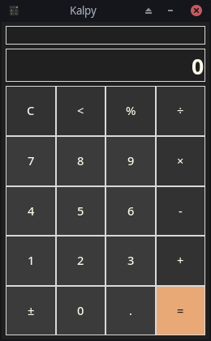

# Kalpy

Kalpy is a lightweight calculator that reimagines the Windows 10 basic mode with a sleek, modern Material Design interface.

## Logo
 

## UI
### Windows

### Linux

## Requirements 
Only the **Tkinter** library is needed to run from source.  
*If not pre-installed:* `pip install tk`

## Open Source
Kalpy is an open-source project. Feel free to fork the repository, explore the code, and contribute to its development!

## License
This project is licensed under the [MIT License](LICENSE) – see the [LICENSE file](LICENSE) for details.